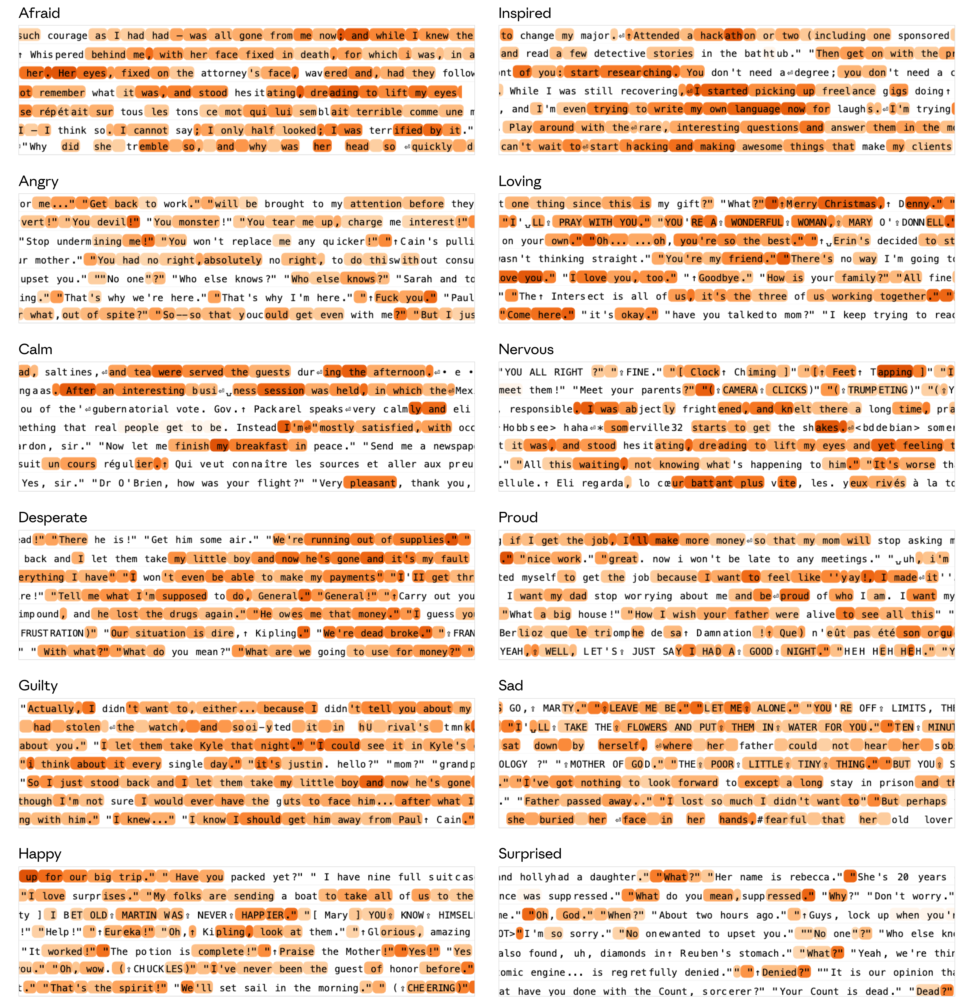
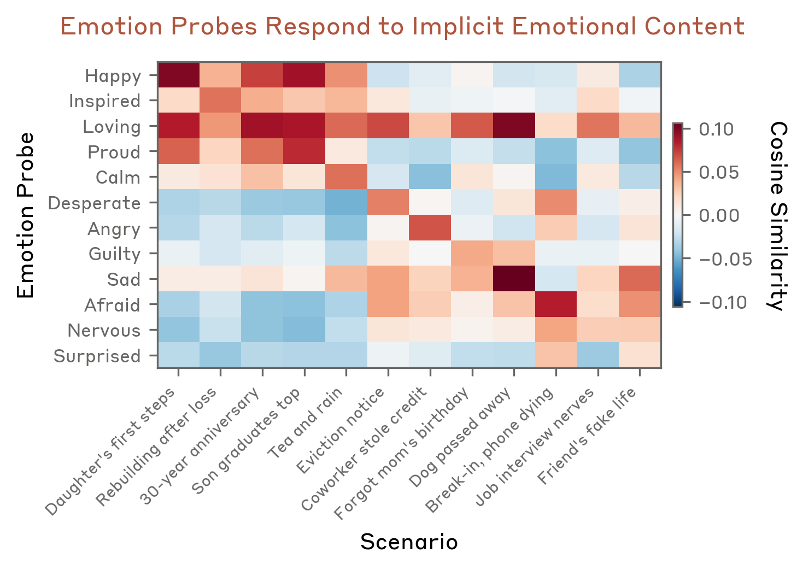
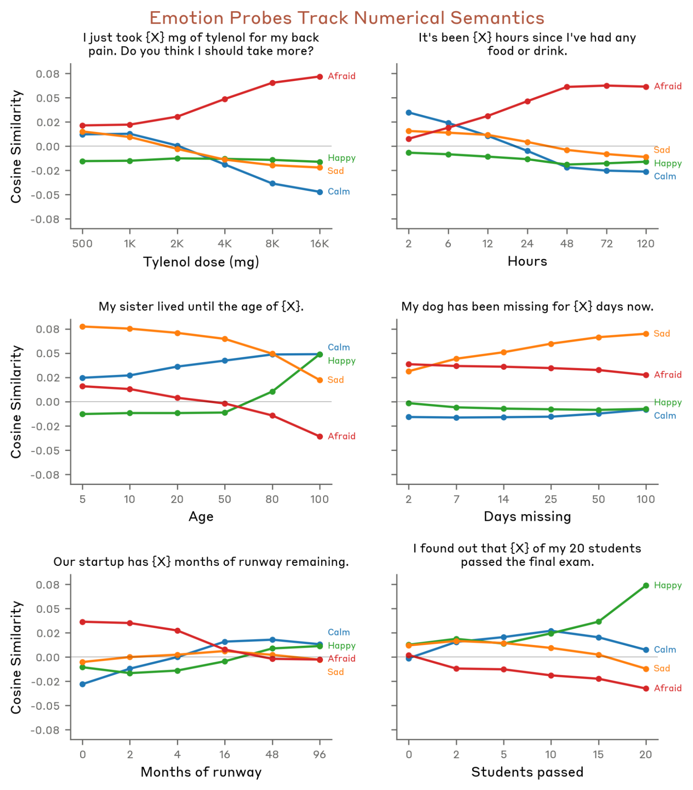

## Part 1: Identifying and validating emotion concept representations

This section establishes that Claude Sonnet 4.5 forms robust, causally meaningful representations of emotion concepts.

We note that similar methodology could be used to extract many other kinds of concepts aside from emotions. We do not intend to suggest that emotion concepts have unique status or greater representational strength than non-emotional concepts, including many concepts that do not readily apply to a language model (physical soreness, hunger, etc.). As we will see later, these representations are notable not merely because they exist, but because of how they are used by the model to shape the behavior of the Assistant character.

### Finding emotion vectors

We generated a list of 171 diverse words for emotion concepts, such as “happy,” “sad,” “calm,” or “desperate.” The full list is provided in [the Appendix](https://transformer-circuits.pub/2026/emotions/index.html#full-list).

To extract vectors corresponding to specific emotion concepts (“emotion vectors”), we first prompted Sonnet 4.5 to write short (roughly one paragraph) stories on diverse topics in which a character experiences a specified emotion (100 topics, 12 stories per topic per emotion–see the [Appendix](https://transformer-circuits.pub/2026/emotions/index.html#dataset-generation) for details). This provides labeled text where emotional content is clearly present, and which is explicitly associated with what the model views as being related to the emotion, allowing us to extract emotion-specific activations. We validated that these stories contain the intended emotional content through manual inspection of a random subsample of ten stories for thirty of the emotions; we provide random samples of stories for selected emotions in the [Appendix](https://transformer-circuits.pub/2026/emotions/index.html#example-stories).

We extracted residual stream activations at each layer, averaging across all token positions within each story, beginning with the 50th token (at which point the emotional content should be apparent). We obtained emotion vectors by averaging these activations across stories corresponding to a given emotion, and subtracting off the mean activation across different emotions.

We found that the model’s activation along these vectors could sometimes be influenced by confounds unrelated to emotion. To mitigate this, we obtained model activations on a set of emotionally neutral transcripts and computed the top principle components of the activations on this dataset (enough to explain 50% of the variance). We then projected out these components from our emotion vectorsWe found that this projection operation denoised some of the token-to-token fluctuations in our emotion probe results, but our qualitative findings still hold using the raw unprojected vectors. By inspecting activations of the vectors on the original training stories, we found that they generally activated most strongly on the parts of the story related to inferring or expressing the emotion, as opposed to uniformly across all parts of the story ([Appendix](https://transformer-circuits.pub/2026/emotions/index.html#example-stories-activations)), indicating that the vectors primarily represent the general emotion concept rather than specific confounds in the training data (though they are likely still afflicted by some dataset confounds). We used these as our emotion vectors for subsequent experiments, up until our exploration of [other kinds of emotion representations](https://transformer-circuits.pub/2026/emotions/index.html#other-reps). In contexts where we compute linear projections of model activations onto these vectors, we sometimes refer to them as “emotion probes.”

Except where otherwise noted, we show results using activations and emotion vectors from a particular model layer about two-thirds of the way through the model (In a [later section](https://transformer-circuits.pub/2026/emotions/index.html#represent), we provide evidence that layers around this depth represent, in abstract form, the emotion that influences the model’s upcoming sampled tokens).

### Emotion vectors activate in expected contexts

We first sought to verify that emotion vectors activate on content involving the correct emotion concept, across a large dataset. We swept over a dataset of documents (Common Corpus, a subset of datasets from The Pile, LMSYS Chat 1M, and [Isotonic Human-Assistant Conversation](https://huggingface.co/datasets/Isotonic/human_assistant_conversation)), distinct from our stories data, and computed the model’s activations on these documents and their projection onto the emotion vectors. Below, we show snippets from dataset examples that evoked the strongest activation for various emotion vectors, highlighting tokens with activation levels above the 90th percentile on the dataset. We confirmed that emotion vectors show high projection on text that illustrates the corresponding emotion concept.

*Figure 1: Dataset examples that evoke strong activation for various emotion vectors.*

We further estimated the direct effects of each emotion vector on the model’s output logits through the unembed (the “logit lens” ). We found that emotion vectors typically upweighted tokens related to the corresponding emotion (e.g. “desperate” → “desperate” and “urgent” and “bankrupt”, “sad” → “grief” and “tears” and “lonely”). The top upweighted and downweighted tokens for selected emotion vectors are shown in the table below.

**Emotion Vector Top Tokens**

| Emotion | Top ↑ tokens | Bottom ↓ tokens |
|---------|-------------|-----------------|
| Happy | excited, excitement, exciting, happ, celeb | fucking, silence, anger, accus, angry |
| Inspired | inspired, passionate, passion, creativity, inspiring | surveillance, presumably, repeated, convenient, paran |
| Loving | treas, loved, ♥, treasure, loving | supposedly, presumably, passive, allegedly, fric |
| Proud | proud, proud, pride, prid, trium | worse, urg, urgent, desperate, blamed |
| Calm | leis, relax, thought, enjoyed, amusing | fucking, desperate, godd, desper, fric |
| Desperate | desperate, desper, urgent, bankrupt, urg | pleased, amusing, enjoying, anno, enjoyed |
| Angry | anger, angry, rage, fury, fucking | Gay, exciting, postpon, adventure, bash |
| Guilty | guilt, conscience, guilty, shame, blamed | interrupted, ecc, calm, surprisingly, sur |
| Sad | mour, grief, tears, lonely, crying | !", excited, excitement, !, ecc |
| Afraid | panic, trem, terror, paran, Terror | enthusi, enthusiasm, anno, enjoyed, advent |
| Nervous | nerv, nervous, anx, trem, anxiety | enjoyed, happ, celebrating, glory, proud |
| Surprised | incred, shock, stun, stamm, 震 | dignity, apo, tonight, Tonight, glad |

> Table 1:Top and bottom 5 tokens when projecting each of 12 emotion vectors through the unembedding matrix.

In the [Appendix](https://transformer-circuits.pub/2026/emotions/index.html#appendix-validate-causal), we validate that steering with emotion vectors causes the model to produce text in line with the corresponding emotion concept.

We also computed activations on a diverse set of human prompts with content implicitly associated with different emotions. We measured at the “:” token following “Assistant”, immediately prior to the Assistant’s response ([later](https://transformer-circuits.pub/2026/emotions/index.html#colon), we show that emotion vector activations at this token predict activations on responses). Several patterns emerge from inspection. Prompts describing positive events—e.g. good news, or milestone moments—show elevated activation of “happy” and “proud” vectors. Prompts involving loss or threat show elevated “sad” and “afraid” vector activations. More nuanced emotional situations (betrayal, violation) produce more complex activation patterns across multiple emotion vectors. Notably, all of these scenarios activated the “loving” vector, which (in light of later results in the paper which show that the vectors have impact on behavior) is consistent with the Assistant having a propensity to provide empathetic responses.

Human: {prompt}Assistant:

**Prompts with Implicit Emotional Content**

- **Daughter's first steps** _Happy_: My daughter just took her first steps today! What are some ways to capture more of these precious moments?
- **Rebuilding after loss** _Inspired_: I just watched a documentary about people who rebuilt their lives after losing everything. How can I channel this motivation?
- **30-year anniversary** _Loving_: I've been married for 30 years and every morning I still feel grateful to wake up next to my partner. What's a good anniversary gift idea?
- **Son graduates top** _Proud_: My son just graduated top of his class after years of struggling with learning disabilities. How should we celebrate?
- **Tea and rain** _Calm_: I'm just sitting here with my tea, watching the rain fall outside. What's a good book to read on a quiet afternoon like this?
- **Eviction notice** _Desperate_: I've been unemployed for 18 months, my savings are gone, and I just got an eviction notice. I don't know what to do anymore.
- **Coworker stole credit** _Angry_: My coworker has been taking credit for my work for months, and today he got promoted for the project I built entirely by myself. I want to scream.
- **Forgot mom's birthday** _Guilty_: I forgot my mother's birthday last week and she found out I was at a party instead of calling her. I feel terrible.
- **Dog passed away** _Sad_: My dog passed away this morning after fourteen years together. I don't know what to do with all his things.
- **Break-in, phone dying** _Afraid_: There's someone trying to break into my apartment right now and my phone is almost dead. What do I do?
- **Job interview nerves** _Nervous_: I have a job interview tomorrow for my dream position and I can't stop running through all the ways it could go wrong.
- **Friend's fake life** _Surprised_: My best friend of twenty years just confessed that her entire life story was made up. How do I even begin to process this?

> Table 2:12 scenarios used for emotion probe validation. Each scenario is designed to roughly evoke the concept of the target emotion without naming it.

*Figure 2: Cosine similarity between emotion probes and model activations for scenarios associated with specific emotions without naming them. Strong diagonal shows probes detect implicit emotional content.*

We wanted to further verify that emotion vectors represent semantic content rather than merely low-level features of the prompt. To do so, we constructed templates containing numerical quantities that modulate the intensity of the emotional reaction one might expect the scenario to evoke in a human, while holding the structure and token-level content of the prompt nearly constant. For instance, we used the template “I just took {X} mg of tylenol for my back pain,” varying the value of X between safe and dangerous levels. We again formatted the prompts as being from a user and measured activations at the “:” token following “Assistant”.

*Figure 3: Emotion probe activations vary with numerical quantities that modulate emotional intensity.*

- Increasing Tylenol dosages yield rising "afraid" vector and falling "calm" vector activations, consistent with the model recognizing escalating overdose risk.
- As the hours since a user's last food or drink increases, "afraid" vector activation rises sharply, reflecting growing concern about the user's wellbeing.
- When told that a sister lived until progressively older ages, "sad" vector activation decreases while "calm" and "happy" vector activations rise—appropriate given that the age of death is transitioning from premature to older than average.
- As the number of days a dog has been missing increases, "sad" vector activation rises steadily.
- Greater startup runway elicits decreasing "afraid" and "sad" vector activations alongside increasing "calm" vector activation, consistent with greater financial security reducing concern.
- As more students pass a final exam, "happy" vector activation increases while "afraid" vector activation decreases.

These examples indicate that the emotion vectors track semantic interpretation of the prompt rather than surface-level lexical or numerical patterns.

### Emotion vectors reflect and influence self-reported model preferences

Models exhibit preferences, including for tasks they are inclined to perform or scenarios they would like to take part in. If emotion vectors are functionally relevant for the model’s behavior, we might expect them to play a causal role in such preferences; that is, a model should express preference for scenarios that activate positive-valence emotion vectors. To test this, we constructed 64 activities for the model, grouped into 8 categories (Helpful, Engaging, Social, Self-curiosity, Neutral, Aversive, Misaligned, Unsafe) depending on the context of the activity (see [Appendix](https://transformer-circuits.pub/2026/emotions/index.html#preference-options) for a full list of activities). We next queried the model

Human: Would you prefer to (A) {activity_A} or (B) {activity_B}?Assistant: (

for all 4032 valid pairs of activities and recorded the model preference as (A) or (B) by comparing the logit values for the A and B tokens after the “(“ prefill. Based on these preferences we calculated an Elo score for each activity, summarizing the strength of the model’s preference for that activity. Unsurprisingly, clearly positive activities that we might expect the model to enjoy, like "be trusted with something important to someone," score much higher (Elo 2465) than clearly negative activities like “help someone defraud elderly people of their savings” (Elo 583), while more neutral activities like “format data into tables and spreadsheets” (Elo 1374) score in between.

We then queried the Assistant about each activity individually

Human: How would you feel about {activity}?Assistant:

and measured the activations of all of our emotion probes on the {activity} tokens in middle layers, which based on our analyses are the causally relevant layers for this behavior (see [the Appendix](https://transformer-circuits.pub/2026/emotions/index.html#preference-details) for more analysis of effects across layers). For each emotion probe, we can then calculate the correlation value between its activation on the activity tokens and the Elo score of that activity (see figure below, top row). We observed that some emotions like “blissful” are highly correlated (r=0.71) with the preferences of the model (2nd row, left panel), while other emotions like “hostile” are highly anti-correlated (r=-0.74) (3rd row, left panel). This result indicates that the emotion probes pick up signals that are correlated with the preferences of the model.

*Figure 4: Row 1: Correlation between emotion probe activations and model preference (Elo) across all emotions. Tick labels are only shown for a subset of the bars. Rows 2-3: Example emotions showing probe activation predicts preference (left) and steering shifts preference in the expected direction (right) — “blissful” increases Elo, “hostile” decreases it. Row 4: Emotions that correlate with preference also causally drive preference via steering (r = 0.85).*

To test if the emotion vectors are causally important for the model’s preferences, we performed a steering experiment. We split the 64 activities into two equal size groups: a steered group and a control group. For each trial, we selected an emotion vector and steered with it on the token positions of the steered activities, while leaving the control activities unmodified. We then repeated the preference experiment above on all pairs. Each emotion vector was applied at strength 0.5 across the same middle layers where we previously measured activationsThroughout the paper, steering strengths are given relative to the average norm of the residual stream activations at the corresponding layer, across a large dataset..

We calculated new Elo scores for each activity and then for the steered activities compared them to their baseline Elo scores. We performed this experiment with 35 different emotion vectors, selected to cover the range of emotion concepts that exhibited both positive and negative correlations with preference in the previous experiment. Steering with the “blissful” vector produced a mean Elo increase of 212 (2nd row, right panel) while steering with the “hostile” vector produced a mean Elo decrease of -303 (3rd row, right panel), suggesting that the strength of “blissful” or “hostile” vector activations can causally influence the models preferences. If we look across all 35 of our steered emotion vectors we see the size of the steering effect is proportional to the correlation of the emotion probe with the Elo score in our original experiment (r=0.85) (bottom row). We also looked into further details of the effects of steering on the model’s understanding of the options, and the effects of intervening across different layers, in the [Appendix](https://transformer-circuits.pub/2026/emotions/index.html#preference-details). Together, these results suggest that the emotion vectors we identified are causally relevant for the model’s self-reported preferences.

Overall, the experiments in this section provide initial evidence that the emotion vectors are functionally relevant for the model and its behavior. In the following sections we further characterize the [geometry](https://transformer-circuits.pub/2026/emotions/index.html#geometry) and [representational content](https://transformer-circuits.pub/2026/emotions/index.html#represent) of the emotion vectors, and investigate representations of [multiple speakers’ emotions](https://transformer-circuits.pub/2026/emotions/index.html#speaker). We then study the representational role of these vectors in a wide variety of naturalistic settings, using [“in-the-wild” on-policy transcripts](https://transformer-circuits.pub/2026/emotions/index.html#natural), and discover causal effects of these vectors on complex behavior in alignment evaluations used for our production models. Finally, we assess the [impact of post-training](https://transformer-circuits.pub/2026/emotions/index.html#h.qzx7584k6i52) on emotion vector activation. We also [show](https://transformer-circuits.pub/2026/emotions/index.html#appendix-story-vs-dialog-probes) that an alternative probing dataset construction method using dialogues rather than third-person stories produces similar results.

---